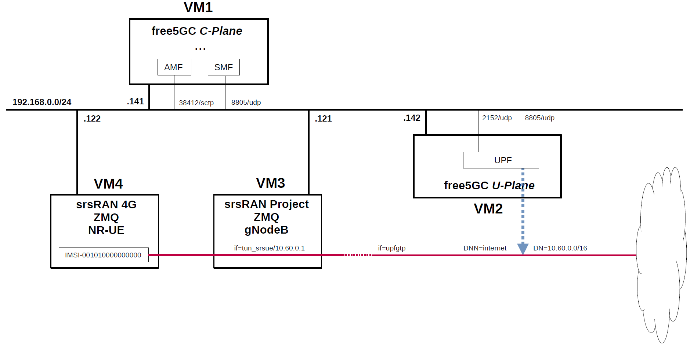

# free5GC 5GC & srsRAN 5G with ZeroMQ UE / RAN Sample Configuration
srsRAN_Project and srsRAN_4G software suites include a virtual radio which uses the ZeroMQ networking library to transfer radio samples between applications.
Therefore, in order to use U-Plane's DN (Data Network) as a trial, I built a simulation environment for the 5GC mobile network.
This briefly describes the overall and configuration files in the Virtualbox VM environment.

---

### [Sample Configurations and Miscellaneous for Mobile Network](https://github.com/s5uishida/sample_config_misc_for_mobile_network)

---

<a id="toc"></a>

## Table of Contents

- [Overview of free5GC 5GC Simulation Mobile Network](#overview)
- [Changes in configuration files of free5GC 5GC and srsRAN 5G ZMQ UE / RAN](#changes)
  - [Changes in configuration files of free5GC 5GC C-Plane](#changes_cp)
  - [Changes in configuration files of free5GC 5GC U-Plane](#changes_up)
  - [Changes in configuration files of srsRAN 5G ZMQ UE / RAN](#changes_srs)
    - [Changes in configuration files of RAN](#changes_ran)
    - [Changes in configuration files of UE](#changes_ue)
- [Network settings of free5GC 5GC](#network_settings)
  - [Network settings of free5GC 5GC U-Plane](#network_settings_up)
- [Build free5GC and srsRAN 5G ZMQ UE / RAN](#build)
  - [Build go-upf](#build_upf)
- [Run free5GC 5GC and srsRAN 5G ZMQ UE / RAN](#run)
  - [Run free5GC 5GC C-Plane](#run_cp)
  - [Run free5GC 5GC U-Plane](#run_up)
  - [Run srsRAN 5G ZMQ RAN](#run_ran)
  - [Run srsRAN 5G ZMQ UE](#run_ue)
- [Ping google.com](#ping)
  - [Case for going through DN 10.45.0.0/16](#ping_1)
- [Changelog (summary)](#changelog)
---
<a id="overview"></a>

## Overview of free5GC 5GC Simulation Mobile Network

I created a 5GC mobile network (Internet reachable) for simulation with the aim of creating an environment in which packets can be sent end-to-end with one DN for one DNN.

The following minimum configuration was set as a condition.
- Only one each for C-Plane, U-Plane and UE.

The built simulation environment is as follows.

</img>

The 5GC / UE / RAN used are as follows.
- 5GC - free5GC v3.4.3 (2024.11.08) - https://github.com/free5gc/free5gc
- RAN - srsRAN Project (2024.10.14) - https://github.com/srsran/srsRAN_Project
- UE (NR-UE) - srsRAN 4G (2024.02.01) - https://github.com/srsran/srsRAN_4G

Each VMs are as follows.  
| VM | SW & Role | IP address | OS | CPU <br> (Min) | Memory <br> (Min) | HDD <br> (Min) |
| --- | --- | --- | --- | --- | --- | --- |
| VM1 | free5GC 5GC C-Plane | 192.168.0.141/24 | Ubuntu 24.04 | 1 | 2GB | 20GB |
| VM2 | free5GC 5GC U-Plane  | 192.168.0.142/24 | Ubuntu 24.04 | 1 | 1GB | 20GB |
| VM3 | srsRAN Project ZMQ RAN<br>(gNodeB) | 192.168.0.121/24 | Ubuntu 24.04 | 2 | 4GB | 10GB |
| VM4 | srsRAN 4G ZMQ UE<br>(NR-UE) | 192.168.0.122/24 | Ubuntu 22.04 | 1 | 2GB | 10GB |

AMF & SMF addresses are as follows.  
| NF | IP address | IP address on SBI | Supported S-NSSAI |
| --- | --- | --- | --- |
| AMF | 192.168.0.141 | 127.0.0.18 | SST:1, SD:0x000001 |
| SMF | 192.168.0.141 | 127.0.0.2 | SST:1, SD:0x000001 |

Subscriber Information (other information is the same) is as follows.  
| UE | IMSI | DNN | OP/OPc | S-NSSAI |
| --- | --- | --- | --- | --- |
| UE (NR-UE) | 001010000000000 | internet | OPc | SST:1, SD:0x000001 |

I registered these information with the free5GC WebUI.
In addition, [3GPP TS 35.208](https://www.3gpp.org/DynaReport/35208.htm) "4.3 Test Sets" is published by 3GPP as test data for the 3GPP authentication and key generation functions (MILENAGE).

DN is as follows.
| DN | S-NSSAI | TUNnel interface of DN | DNN | TUNnel interface of UE |
| --- | --- | --- | --- | --- |
| 10.60.0.0/16 | SST:1 <br> SD:0x000001 | upfgtp | internet | tun_srsue |

The main information of gNodeB is as follows.
| MCC | MNC | TAC | gNodeB ID |
| --- | --- | --- | --- |
| 001 | 01 | 1 | 0x19b |

Additional information.

free5GC 5GC U-Plane worked fine on Raspberry Pi 4 Model B. I used [Ubuntu 20.04 (64bit) for Raspberry Pi 4](https://ubuntu.com/download/raspberry-pi) as the OS. I think it would be convenient to place a compact U-Plane in the edge environment and use it as an end-point for DN.

In addition, I have not confirmed the communication performance.

<a id="changes"></a>

## Changes in configuration files of free5GC 5GC and srsRAN 5G ZMQ UE / RAN

Please refer to the following for building free5GC and srsRAN 5G ZMQ UE / RAN respectively.
- free5GC v3.4.3 (2024.11.08) - https://free5gc.org/guide/
- srsRAN Project (RAN) (2024.10.14) - https://github.com/s5uishida/build_srsran_5g_zmq
- srsRAN 4G (UE) (2024.02.01) - https://github.com/s5uishida/build_srsran_4g_zmq_disable_rf_plugins

<a id="changes_cp"></a>

### Changes in configuration files of free5GC 5GC C-Plane

The combination of DNN and S-NSSAI parameters can be used in the logic that selects UPF as the connection destination by PFCP.

- DNN
- S-NSSAI

For the sake of simplicity, This time, only DNN will be changed. S-NSSAI is fixed as `SST=1` and `SD=000001`.

- `free5gc/config/amfcfg.yaml`
```diff
--- amfcfg.yaml.orig    2024-11-08 20:40:28.168990246 +0900
+++ amfcfg.yaml 2024-11-08 20:54:28.718304197 +0900
@@ -5,7 +5,7 @@
 configuration:
   amfName: AMF # the name of this AMF
   ngapIpList:  # the IP list of N2 interfaces on this AMF
-    - 127.0.0.18
+    - 192.168.0.141
   ngapPort: 38412 # the SCTP port listened by NGAP
 
   # Service-based Interface (SBI) Configuration
@@ -30,25 +30,25 @@
   servedGuamiList:
     # <GUAMI> = <MCC><MNC><AMF ID>
     - plmnId: # Public Land Mobile Network ID, <PLMN ID> = <MCC><MNC>
-        mcc: 208 # Mobile Country Code (3 digits string, digit: 0~9)
-        mnc: 93 # Mobile Network Code (2 or 3 digits string, digit: 0~9)
+        mcc: 001 # Mobile Country Code (3 digits string, digit: 0~9)
+        mnc: 01 # Mobile Network Code (2 or 3 digits string, digit: 0~9)
       amfId: cafe00 # AMF identifier (3 bytes hex string, range: 000000~FFFFFF)
 
   # the TAI (Tracking Area Identifier) list supported by this AMF
   supportTaiList:
     - plmnId: # Public Land Mobile Network ID, <PLMN ID> = <MCC><MNC>
-        mcc: 208 # Mobile Country Code (3 digits string, digit: 0~9)
-        mnc: 93 # Mobile Network Code (2 or 3 digits string, digit: 0~9)
+        mcc: 001 # Mobile Country Code (3 digits string, digit: 0~9)
+        mnc: 01 # Mobile Network Code (2 or 3 digits string, digit: 0~9)
       tac: 000001 # Tracking Area Code (3 bytes hex string, range: 000000~FFFFFF)
 
   # the PLMNs (Public land mobile network) list supported by this AMF
   plmnSupportList:
     - plmnId: # Public Land Mobile Network ID, <PLMN ID> = <MCC><MNC>
-        mcc: 208 # Mobile Country Code (3 digits string, digit: 0~9)
-        mnc: 93 # Mobile Network Code (2 or 3 digits string, digit: 0~9)
+        mcc: 001 # Mobile Country Code (3 digits string, digit: 0~9)
+        mnc: 01 # Mobile Network Code (2 or 3 digits string, digit: 0~9)
       snssaiList: # the S-NSSAI (Single Network Slice Selection Assistance Information) list supported by this AMF
         - sst: 1 # Slice/Service Type (uinteger, range: 0~255)
-          sd: 010203 # Slice Differentiator (3 bytes hex string, range: 000000~FFFFFF)
+          sd: 000001 # Slice Differentiator (3 bytes hex string, range: 000000~FFFFFF)
         - sst: 1 # Slice/Service Type (uinteger, range: 0~255)
           sd: 112233 # Slice Differentiator (3 bytes hex string, range: 000000~FFFFFF)
 
```
- `free5gc/config/ausfcfg.yaml`
```diff
--- ausfcfg.yaml.orig   2024-03-30 10:35:10.534612278 +0900
+++ ausfcfg.yaml        2024-03-30 10:48:53.470630936 +0900
@@ -16,10 +16,8 @@
   nrfUri: http://127.0.0.10:8000 # a valid URI of NRF
   nrfCertPem: cert/nrf.pem # NRF Certificate
   plmnSupportList: # the PLMNs (Public Land Mobile Network) list supported by this AUSF
-    - mcc: 208 # Mobile Country Code (3 digits string, digit: 0~9)
-      mnc: 93  # Mobile Network Code (2 or 3 digits string, digit: 0~9)
-    - mcc: 123 # Mobile Country Code (3 digits string, digit: 0~9)
-      mnc: 45  # Mobile Network Code (2 or 3 digits string, digit: 0~9)
+    - mcc: 001 # Mobile Country Code (3 digits string, digit: 0~9)
+      mnc: 01  # Mobile Network Code (2 or 3 digits string, digit: 0~9)
   groupId: ausfGroup001 # ID for the group of the AUSF
   eapAkaSupiImsiPrefix: false # including "imsi-" prefix or not when using the SUPI to do EAP-AKA' authentication

```
- `free5gc/config/nrfcfg.yaml`
```diff
--- nrfcfg.yaml.orig    2024-11-08 20:40:28.168990246 +0900
+++ nrfcfg.yaml 2024-11-08 20:55:32.351444163 +0900
@@ -18,8 +18,8 @@
       key: cert/root.key
     oauth: true
   DefaultPlmnId:
-    mcc: 208 # Mobile Country Code (3 digits string, digit: 0~9)
-    mnc: 93 # Mobile Network Code (2 or 3 digits string, digit: 0~9)
+    mcc: 001 # Mobile Country Code (3 digits string, digit: 0~9)
+    mnc: 01 # Mobile Network Code (2 or 3 digits string, digit: 0~9)
   serviceNameList: # the SBI services provided by this NRF, refer to TS 29.510
     - nnrf-nfm # Nnrf_NFManagement service
     - nnrf-disc # Nnrf_NFDiscovery service
```
- `free5gc/config/nssfcfg.yaml`
```diff
--- nssfcfg.yaml.orig   2024-03-30 10:35:10.535609025 +0900
+++ nssfcfg.yaml        2024-03-31 20:33:17.782753733 +0900
@@ -18,15 +18,15 @@
   nrfUri: http://127.0.0.10:8000 # a valid URI of NRF
   nrfCertPem: cert/nrf.pem # NRF Certificate
   supportedPlmnList: # the PLMNs (Public land mobile network) list supported by this NSSF
-    - mcc: 208 # Mobile Country Code (3 digits string, digit: 0~9)
-      mnc: 93 # Mobile Network Code (2 or 3 digits string, digit: 0~9)
+    - mcc: 001 # Mobile Country Code (3 digits string, digit: 0~9)
+      mnc: 01 # Mobile Network Code (2 or 3 digits string, digit: 0~9)
   supportedNssaiInPlmnList: # Supported S-NSSAI List for each PLMN
     - plmnId: # Public Land Mobile Network ID, <PLMN ID> = <MCC><MNC>
-        mcc: 208 # Mobile Country Code (3 digits string, digit: 0~9)
-        mnc: 93 # Mobile Network Code (2 or 3 digits string, digit: 0~9)
+        mcc: 001 # Mobile Country Code (3 digits string, digit: 0~9)
+        mnc: 01 # Mobile Network Code (2 or 3 digits string, digit: 0~9)
       supportedSnssaiList: # Supported S-NSSAIs of the PLMN
         - sst: 1 # Slice/Service Type (uinteger, range: 0~255)
-          sd: 010203 # Slice Differentiator (3 bytes hex string, range: 000000~FFFFFF)
+          sd: 000001 # Slice Differentiator (3 bytes hex string, range: 000000~FFFFFF)
         - sst: 1 # Slice/Service Type (uinteger, range: 0~255)
           sd: 112233 # Slice Differentiator (3 bytes hex string, range: 000000~FFFFFF)
         - sst: 1 # Slice/Service Type (uinteger, range: 0~255)
```
- `free5gc/config/smfcfg.yaml`
```diff
--- smfcfg.yaml.orig    2024-11-08 20:40:28.168990246 +0900
+++ smfcfg.yaml 2024-11-08 21:00:49.058250902 +0900
@@ -25,7 +25,7 @@
   snssaiInfos:
     - sNssai: # S-NSSAI (Single Network Slice Selection Assistance Information)
         sst: 1 # Slice/Service Type (uinteger, range: 0~255)
-        sd: 010203 # Slice Differentiator (3 bytes hex string, range: 000000~FFFFFF)
+        sd: 000001 # Slice Differentiator (3 bytes hex string, range: 000000~FFFFFF)
       dnnInfos: # DNN information list
         - dnn: internet # Data Network Name
           dns: # the IP address of DNS
@@ -42,16 +42,16 @@
 
   # Optional: PLMN IDs configuration.
   plmnList:
-    - mcc: 208 # Mobile Country Code (3 digits string, digit: 0~9)
-      mnc: 93 # Mobile Network Code (2 or 3 digits string, digit: 0~9)
+    - mcc: 001 # Mobile Country Code (3 digits string, digit: 0~9)
+      mnc: 01 # Mobile Network Code (2 or 3 digits string, digit: 0~9)
   locality: area1 # Name of the location where a set of AMF, SMF, PCF and UPFs are located
 
   # PFCP (Packet Forwarding Control Protocol) configuration for N4 interface.
   pfcp:
     # addr config is deprecated in smf config v1.0.3, please use the following config
-    nodeID: 127.0.0.1 # the Node ID of this SMF
-    listenAddr: 127.0.0.1 # the IP/FQDN of N4 interface on this SMF (PFCP)
-    externalAddr: 127.0.0.1 # the IP/FQDN of N4 interface on this SMF (PFCP)
+    nodeID: 192.168.0.141 # the Node ID of this SMF
+    listenAddr: 192.168.0.141 # the IP/FQDN of N4 interface on this SMF (PFCP)
+    externalAddr: 192.168.0.141 # the IP/FQDN of N4 interface on this SMF (PFCP)
     assocFailAlertInterval: 10s
     assocFailRetryInterval: 30s
     heartbeatInterval: 10s
@@ -63,12 +63,12 @@
         type: AN # the type of the node (AN or UPF)
       UPF: # the name of the node
         type: UPF # the type of the node (AN or UPF)
-        nodeID: 127.0.0.8 # the Node ID of this UPF
-        addr: 127.0.0.8 # the IP/FQDN of N4 interface on this UPF (PFCP)
+        nodeID: 192.168.0.142 # the Node ID of this UPF
+        addr: 192.168.0.142 # the IP/FQDN of N4 interface on this UPF (PFCP)
         sNssaiUpfInfos: # S-NSSAI information list for this UPF
           - sNssai: # S-NSSAI (Single Network Slice Selection Assistance Information)
               sst: 1 # Slice/Service Type (uinteger, range: 0~255)
-              sd: 010203 # Slice Differentiator (3 bytes hex string, range: 000000~FFFFFF)
+              sd: 000001 # Slice Differentiator (3 bytes hex string, range: 000000~FFFFFF)
             dnnUpfInfoList: # DNN information list for this S-NSSAI
               - dnn: internet
                 pools:
@@ -91,7 +91,7 @@
         interfaces: # Interface list for this UPF
           - interfaceType: N3 # the type of the interface (N3 or N9)
             endpoints: # the IP address of this N3/N9 interface on this UPF
-              - 127.0.0.8
+              - 192.168.0.142
             networkInstances: # Data Network Name (DNN)
               - internet
 
@@ -99,7 +99,7 @@
     links:
       - A: gNB1
         B: UPF
-
+  ulcl: false
   # retransmission timer for PDU session modification command
   t3591:
     enable: true # true or false
```

<a id="changes_up"></a>

### Changes in configuration files of free5GC 5GC U-Plane

- `go-upf/upfcfg.yaml`
```diff
--- upfcfg.yaml.orig    2024-11-08 21:13:34.233104350 +0900
+++ upfcfg.yaml 2024-11-08 21:15:50.546333816 +0900
@@ -4,8 +4,8 @@
 # PFCP Configuration
 # The listen IP and nodeID of the N4 interface on this UPF (Can't set to 0.0.0.0)
 pfcp:
-  addr: 127.0.0.8   # IP addr for listening
-  nodeID: 127.0.0.8 # External IP or FQDN can be reached
+  addr: 192.168.0.142   # IP addr for listening
+  nodeID: 192.168.0.142 # External IP or FQDN can be reached
   retransTimeout: 1s # retransmission timeout
   maxRetrans: 3 # the max number of retransmission
 
@@ -18,7 +18,7 @@
   # If you bind to a specific IP, ensure SMF uses the same IP in its N3 configuration.
   # If you bind to all (0.0.0.0), SMF can use any of the available UPF IPs, but do not use 0.0.0.0 in SMF.
   ifList:
-    - addr: 127.0.0.8
+    - addr: 192.168.0.142
       type: N3
       # name: upf.5gc.nctu.me
       # ifname: gtpif
@@ -29,8 +29,6 @@
 dnnList:
   - dnn: internet # Data Network Name
     cidr: 10.60.0.0/16 # Classless Inter-Domain Routing for assigned IPv4 pool of UE
-  - dnn: internet # Data Network Name
-    cidr: 10.61.0.0/16 # Classless Inter-Domain Routing for assigned IPv4 pool of UE
     # natifname: eth0
 
 # Logging Configuration
```

<a id="changes_srs"></a>

### Changes in configuration files of srsRAN 5G ZMQ UE / RAN

<a id="changes_ran"></a>

#### Changes in configuration files of RAN

See [here](https://github.com/s5uishida/build_srsran_5g_zmq#create-the-configuration-file-of-gnodeb) for the original files.

- `srsRAN_Project/build/apps/gnb/gnb_zmq.yaml`
```diff
--- gnb_zmq.yaml.orig   2024-10-14 18:46:45.000000000 +0900
+++ gnb_zmq.yaml        2024-11-08 22:03:11.886411264 +0900
@@ -3,22 +3,33 @@
 # To run the srsRAN Project gNB with this config, use the following command: 
 #   sudo ./gnb -c gnb_zmq.yaml
 
+gnb_id: 0x19B
+
+cu_up:
+  upf:
+    bind_addr: 192.168.0.121              # Optional TEXT. Sets local IP address to bind for N3 interface. Format: IPV4 or IPV6 IP address.
+    ext_addr: auto                        # Optional TEXT. Sets external IP address that is advertised to receive GTP-U packets from UPF via N3 interface. Format: IPV4 or IPV6 IP address.
+    udp_max_rx_msgs: 256                  # Optional INT. Sets the maximum amount of messages RX in a single syscall.
+    pool_threshold: 0.9                   # Optional FLOAT. Sets the pool accupancy threshold after which packets are dropped. Supported: [0.0 - 1.0].
+    no_core: false                        # Optional BOOLEAN. Setting to true allows the gNB to run without a core. Supported: [0, 1].
+
 cu_cp:
   amf:
-    addr: 10.53.1.2                 # The address or hostname of the AMF.
+    addr: 192.168.0.141                 # The address or hostname of the AMF.
     port: 38412
-    bind_addr: 10.53.1.1            # A local IP that the gNB binds to for traffic from the AMF.
+    bind_addr: 192.168.0.121            # A local IP that the gNB binds to for traffic from the AMF.
     supported_tracking_areas:
-      - tac: 7
+      - tac: 1
         plmn_list:
           - plmn: "00101"
             tai_slice_support_list:
               - sst: 1
+                sd: 1
   inactivity_timer: 7200            # Sets the UE/PDU Session/DRB inactivity timer to 7200 seconds. Supported: [1 - 7200].
 
 ru_sdr:
   device_driver: zmq                # The RF driver name.
-  device_args: tx_port=tcp://127.0.0.1:2000,rx_port=tcp://127.0.0.1:2001,base_srate=23.04e6 # Optionally pass arguments to the selected RF driver.
+  device_args: tx_port=tcp://192.168.0.121:2000,rx_port=tcp://192.168.0.122:2001,base_srate=23.04e6 # Optionally pass arguments to the selected RF driver.
   srate: 23.04                      # RF sample rate might need to be adjusted according to selected bandwidth.
   tx_gain: 75                       # Transmit gain of the RF might need to adjusted to the given situation.
   rx_gain: 75                       # Receive gain of the RF might need to adjusted to the given situation.
@@ -29,7 +40,7 @@
   channel_bandwidth_MHz: 20         # Bandwith in MHz. Number of PRBs will be automatically derived.
   common_scs: 15                    # Subcarrier spacing in kHz used for data.
   plmn: "00101"                     # PLMN broadcasted by the gNB.
-  tac: 7                            # Tracking area code (needs to match the core configuration).
+  tac: 1                            # Tracking area code (needs to match the core configuration).
   pdcch:
     common:
       ss0_index: 0                  # Set search space zero index to match srsUE capabilities
```

<a id="changes_ue"></a>

#### Changes in configuration files of UE

See [here](https://github.com/s5uishida/build_srsran_4g_zmq_disable_rf_plugins#create-the-configuration-file-of-nr-ue) for the original files.

- `srsRAN_4G/build/srsue/ue_zmq.conf`
```diff
--- ue_zmq.conf.orig    2023-12-07 03:04:57.000000000 +0900
+++ ue_zmq.conf 2024-03-31 20:55:24.907470983 +0900
@@ -6,7 +6,7 @@
 nof_antennas = 1
 
 device_name = zmq
-device_args = tx_port=tcp://127.0.0.1:2001,rx_port=tcp://127.0.0.1:2000,base_srate=23.04e6
+device_args = tx_port=tcp://192.168.0.122:2001,rx_port=tcp://192.168.0.121:2000,base_srate=23.04e6
 
 [rat.eutra]
 dl_earfcn = 2850
@@ -34,9 +34,9 @@
 [usim]
 mode = soft
 algo = milenage
-opc  = 63BFA50EE6523365FF14C1F45F88737D
-k    = 00112233445566778899aabbccddeeff
-imsi = 001010123456780
+opc  = 8e27b6af0e692e750f32667a3b14605d
+k    = 8baf473f2f8fd09487cccbd7097c6862
+imsi = 001010000000000
 imei = 353490069873319
 
 [rrc]
@@ -44,11 +44,16 @@
 ue_category = 4
 
 [nas]
-apn = srsapn
+apn = internet
 apn_protocol = ipv4
 
+[slicing]
+enable = true
+nssai-sst = 1
+nssai-sd = 1
+
 [gw]
-netns = ue1
+#netns = ue1
 ip_devname = tun_srsue
 ip_netmask = 255.255.255.0
 
```

<a id="network_settings"></a>

## Network settings of free5GC 5GC

<a id="network_settings_up"></a>

### Network settings of free5GC 5GC U-Plane

First, uncomment the next line in the `/etc/sysctl.conf` file and reflect it in the OS.
```
net.ipv4.ip_forward=1
```
```
# sysctl -p
```
Next, configure the TUNnel interface and NAPT.
```
# iptables -t nat -A POSTROUTING -s 10.60.0.0/16 ! -o upfgtp -j MASQUERADE
```

<a id="build"></a>

## Build free5GC and srsRAN 5G ZMQ UE / RAN

Please refer to the following for building free5GC and srsRAN 5G ZMQ UE / RAN respectively.
- free5GC v3.4.3 (2024.11.08) - https://free5gc.org/guide/
- srsRAN Project (RAN) (2024.10.14) - https://github.com/s5uishida/build_srsran_5g_zmq
- srsRAN 4G (UE) (2024.02.01) - https://github.com/s5uishida/build_srsran_4g_zmq_disable_rf_plugins

Install MongoDB on free5GC 5GC C-Plane machine.
It is not necessary to install MongoDB on free5GC 5GC U-Plane machines.
[MongoDB Compass](https://www.mongodb.com/products/compass) is a convenient tool to look at the MongoDB database.

**Note. The installation guide also includes instructions on building the latest committed version.**

<a id="build_upf"></a>

### Build go-upf

Please refer to the free5GC guide at the above URL for building free5GC UPF. Below show only the differences in the procedure.
```
# git clone https://github.com/free5gc/go-upf.git
# cd go-upf
# CGO_ENABLED=0 go build -o upf cmd/main.go
# ls upf
upf
# wget https://raw.githubusercontent.com/free5gc/free5gc/main/config/upfcfg.yaml
```

<a id="run"></a>

## Run free5GC 5GC and srsRAN 5G ZMQ UE / RAN

First run the 5GC, then the RAN, and the UE.

<a id="run_cp"></a>

### Run free5GC 5GC C-Plane

First, run free5GC 5GC C-Plane.

- free5GC 5GC C-Plane

Create the following shell script and run it.
```bash
#!/usr/bin/env bash

PID_LIST=()

NF_LIST="nrf amf smf udr pcf udm nssf ausf chf"

export GIN_MODE=release

for NF in ${NF_LIST}; do
    ./bin/${NF} &
    PID_LIST+=($!)
    sleep 1
done

function terminate()
{
    sudo kill -SIGTERM ${PID_LIST[${#PID_LIST[@]}-2]} ${PID_LIST[${#PID_LIST[@]}-1]}
    sleep 2
}

trap terminate SIGINT
wait ${PID_LIST}
```

<a id="run_up"></a>

### Run free5GC 5GC U-Plane

Next, run free5GC 5GC U-Plane.

- free5GC 5GC U-Plane
```
# cd go-upf
# ./upf -c upfcfg.yaml
```

<a id="run_ran"></a>

### Run srsRAN 5G ZMQ RAN

Run srsRAN 5G ZMQ RAN and connect to free5GC 5GC.
```
# cd srsRAN_Project/build/apps/gnb
# ./gnb -c gnb_zmq.yaml

--== srsRAN gNB (commit 9d5dd742a) ==--


The PRACH detector will not meet the performance requirements with the configuration {Format 0, ZCZ 0, SCS 1.25kHz, Rx ports 1}.
Lower PHY in executor blocking mode.
Available radio types: zmq.
Cell pci=1, bw=20 MHz, 1T1R, dl_arfcn=368500 (n3), dl_freq=1842.5 MHz, dl_ssb_arfcn=368410, ul_freq=1747.5 MHz

N2: Connection to AMF on 192.168.0.141:38412 completed
==== gNB started ===
Type <h> to view help
```
The free5GC C-Plane log when executed is as follows.
```
2024-11-08T22:44:10.656039758+09:00 [INFO][AMF][Ngap] [AMF] SCTP Accept from: 192.168.0.121:58446
2024-11-08T22:44:10.656587595+09:00 [INFO][AMF][Ngap] Create a new NG connection for: 192.168.0.121:58446
2024-11-08T22:44:10.657802795+09:00 [INFO][AMF][Ngap][ran_addr:192.168.0.121:58446] Handle NGSetupRequest
2024-11-08T22:44:10.658088002+09:00 [INFO][AMF][Ngap][ran_addr:192.168.0.121:58446] Send NG-Setup response
```

<a id="run_ue"></a>

### Run srsRAN 5G ZMQ UE

Run srsRAN 5G ZMQ UE and connect to free5GC 5GC.
```
# cd srsRAN_4G/build/srsue
# ./src/srsue ue_zmq.conf
Reading configuration file ue_zmq.conf...

Built in Release mode using commit ec29b0c1f on branch master.

Opening 1 channels in RF device=zmq with args=tx_port=tcp://192.168.0.122:2001,rx_port=tcp://192.168.0.121:2000,base_srate=23.04e6
Supported RF device list: zmq file
CHx base_srate=23.04e6
Current sample rate is 1.92 MHz with a base rate of 23.04 MHz (x12 decimation)
CH0 rx_port=tcp://192.168.0.121:2000
CH0 tx_port=tcp://192.168.0.122:2001
Current sample rate is 23.04 MHz with a base rate of 23.04 MHz (x1 decimation)
Current sample rate is 23.04 MHz with a base rate of 23.04 MHz (x1 decimation)
Waiting PHY to initialize ... done!
Attaching UE...
Random Access Transmission: prach_occasion=0, preamble_index=0, ra-rnti=0x39, tti=174
Random Access Complete.     c-rnti=0x4601, ta=0
RRC Connected
PDU Session Establishment successful. IP: 10.60.0.1
RRC NR reconfiguration successful.
```
The free5GC C-Plane log when executed is as follows.
```
2024-11-08T22:45:31.740066253+09:00 [INFO][AMF][Ngap][ran_addr:192.168.0.121:58446] Handle InitialUEMessage
2024-11-08T22:45:31.740137141+09:00 [INFO][AMF][Ngap][amf_ue_ngap_id:RU:0,AU:1(3GPP)][ran_addr:192.168.0.121:58446] New RanUe [RanUeNgapID:0][AmfUeNgapID:1]
2024-11-08T22:45:31.740205109+09:00 [INFO][AMF][Ngap][ran_addr:192.168.0.121:58446] 5GSMobileIdentity ["SUCI":"suci-0-001-01-0000-0-0-0000000000", err: <nil>]
2024-11-08T22:45:31.740750601+09:00 [INFO][AMF][CTX] New AmfUe [supi:][guti:00101cafe0000000001]
2024-11-08T22:45:31.740784006+09:00 [INFO][AMF][Gmm] Handle event[Gmm Message], transition from [Deregistered] to [Deregistered]
2024-11-08T22:45:31.740791865+09:00 [INFO][AMF][Gmm][amf_ue_ngap_id:RU:0,AU:1(3GPP)][supi:SUPI:] Handle Registration Request
2024-11-08T22:45:31.740798713+09:00 [INFO][AMF][Gmm][amf_ue_ngap_id:RU:0,AU:1(3GPP)][supi:SUPI:] RegistrationType: Initial Registration
2024-11-08T22:45:31.740805436+09:00 [INFO][AMF][Gmm][amf_ue_ngap_id:RU:0,AU:1(3GPP)][supi:SUPI:] MobileIdentity5GS: SUCI[suci-0-001-01-0000-0-0-0000000000]
2024-11-08T22:45:31.740815999+09:00 [INFO][AMF][Gmm] Handle event[Start Authentication], transition from [Deregistered] to [Authentication]
2024-11-08T22:45:31.740822039+09:00 [INFO][AMF][Gmm][amf_ue_ngap_id:RU:0,AU:1(3GPP)][supi:SUPI:] Authentication procedure
2024-11-08T22:45:31.741768122+09:00 [INFO][NRF][Token] In HTTPAccessTokenRequest
2024-11-08T22:45:31.743584689+09:00 [WARN][NRF][Token] Certificate verify: x509: certificate signed by unknown authority (possibly because of "x509: invalid signature: parent certificate cannot sign this kind of certificate" while trying to verify candidate authority certificate "free5gc")
2024-11-08T22:45:31.746007336+09:00 [INFO][NRF][GIN] | 200 |       127.0.0.1 | POST    | /oauth2/token |
2024-11-08T22:45:31.747119471+09:00 [INFO][NRF][DISC] Handle NFDiscoveryRequest
2024-11-08T22:45:31.748295464+09:00 [INFO][NRF][GIN] | 200 |       127.0.0.1 | GET     | /nnrf-disc/v1/nf-instances?requester-nf-type=AMF&target-nf-type=AUSF |
2024-11-08T22:45:31.749043527+09:00 [INFO][NRF][Token] In HTTPAccessTokenRequest
2024-11-08T22:45:31.750752341+09:00 [WARN][NRF][Token] Certificate verify: x509: certificate signed by unknown authority (possibly because of "x509: invalid signature: parent certificate cannot sign this kind of certificate" while trying to verify candidate authority certificate "free5gc")
2024-11-08T22:45:31.753730889+09:00 [INFO][NRF][GIN] | 200 |       127.0.0.1 | POST    | /oauth2/token |
2024-11-08T22:45:31.755837712+09:00 [INFO][AUSF][UeAuth] HandleUeAuthPostRequest
2024-11-08T22:45:31.756078120+09:00 [INFO][AUSF][UeAuth] Serving network authorized
2024-11-08T22:45:31.756995657+09:00 [INFO][NRF][Token] In HTTPAccessTokenRequest
2024-11-08T22:45:31.758272872+09:00 [WARN][NRF][Token] Certificate verify: x509: certificate signed by unknown authority (possibly because of "x509: invalid signature: parent certificate cannot sign this kind of certificate" while trying to verify candidate authority certificate "free5gc")
2024-11-08T22:45:31.760677362+09:00 [INFO][NRF][GIN] | 200 |       127.0.0.1 | POST    | /oauth2/token |
2024-11-08T22:45:31.761664211+09:00 [INFO][NRF][DISC] Handle NFDiscoveryRequest
2024-11-08T22:45:31.763171605+09:00 [INFO][NRF][GIN] | 200 |       127.0.0.1 | GET     | /nnrf-disc/v1/nf-instances?requester-nf-type=AUSF&service-names=nudm-ueau&target-nf-type=UDM |
2024-11-08T22:45:31.763939895+09:00 [INFO][NRF][Token] In HTTPAccessTokenRequest
2024-11-08T22:45:31.765258272+09:00 [WARN][NRF][Token] Certificate verify: x509: certificate signed by unknown authority (possibly because of "x509: invalid signature: parent certificate cannot sign this kind of certificate" while trying to verify candidate authority certificate "free5gc")
2024-11-08T22:45:31.768293935+09:00 [INFO][NRF][GIN] | 200 |       127.0.0.1 | POST    | /oauth2/token |
2024-11-08T22:45:31.770270478+09:00 [INFO][UDM][UEAU] Handle GenerateAuthDataRequest
2024-11-08T22:45:31.771288343+09:00 [INFO][NRF][Token] In HTTPAccessTokenRequest
2024-11-08T22:45:31.773175933+09:00 [WARN][NRF][Token] Certificate verify: x509: certificate signed by unknown authority (possibly because of "x509: invalid signature: parent certificate cannot sign this kind of certificate" while trying to verify candidate authority certificate "free5gc")
2024-11-08T22:45:31.777733114+09:00 [INFO][NRF][GIN] | 200 |       127.0.0.1 | POST    | /oauth2/token |
2024-11-08T22:45:31.778649899+09:00 [INFO][UDM][Suci] suciPart: [suci 0 001 01 0000 0 0 0000000000]
2024-11-08T22:45:31.778688726+09:00 [INFO][UDM][Suci] scheme 0
2024-11-08T22:45:31.778700914+09:00 [INFO][UDM][Suci] SUPI type is IMSI
http://127.0.0.10:8000
2024-11-08T22:45:31.778948333+09:00 [INFO][NRF][Token] In HTTPAccessTokenRequest
2024-11-08T22:45:31.780590238+09:00 [WARN][NRF][Token] Certificate verify: x509: certificate signed by unknown authority (possibly because of "x509: invalid signature: parent certificate cannot sign this kind of certificate" while trying to verify candidate authority certificate "free5gc")
2024-11-08T22:45:31.782820919+09:00 [INFO][NRF][GIN] | 200 |       127.0.0.1 | POST    | /oauth2/token |
2024-11-08T22:45:31.783732481+09:00 [INFO][NRF][DISC] Handle NFDiscoveryRequest
2024-11-08T22:45:31.784852711+09:00 [INFO][NRF][GIN] | 200 |       127.0.0.1 | GET     | /nnrf-disc/v1/nf-instances?requester-nf-type=UDM&target-nf-type=UDR |
2024-11-08T22:45:31.787965448+09:00 [INFO][UDR][GIN] | 200 |       127.0.0.1 | GET     | /nudr-dr/v1/subscription-data/imsi-001010000000000/authentication-data/authentication-subscription |
2024-11-08T22:45:31.789223115+09:00 [INFO][UDM][UEAU] Nil Op
2024-11-08T22:45:31.792754793+09:00 [INFO][UDR][GIN] | 204 |       127.0.0.1 | PATCH   | /nudr-dr/v1/subscription-data/imsi-001010000000000/authentication-data/authentication-subscription |
2024-11-08T22:45:31.794429601+09:00 [INFO][UDM][GIN] | 200 |       127.0.0.1 | POST    | /nudm-ueau/v1/suci-0-001-01-0000-0-0-0000000000/security-information/generate-auth-data |
2024-11-08T22:45:31.794866123+09:00 [INFO][AUSF][UeAuth] Add SuciSupiPair (suci-0-001-01-0000-0-0-0000000000, imsi-001010000000000) to map.
2024-11-08T22:45:31.794937513+09:00 [INFO][AUSF][UeAuth] Use 5G AKA auth method
2024-11-08T22:45:31.794990144+09:00 [INFO][AUSF][5gAka] XresStar = 3961663036646135333363383166663532323439633463323265303037323463
2024-11-08T22:45:31.795193491+09:00 [INFO][AUSF][GIN] | 201 |       127.0.0.1 | POST    | /nausf-auth/v1/ue-authentications |
2024-11-08T22:45:31.795949787+09:00 [INFO][AMF][Gmm][amf_ue_ngap_id:RU:0,AU:1(3GPP)][supi:SUPI:] Send Authentication Request
2024-11-08T22:45:31.796270469+09:00 [INFO][AMF][Ngap][amf_ue_ngap_id:RU:0,AU:1(3GPP)][ran_addr:192.168.0.121:58446] Send Downlink Nas Transport
2024-11-08T22:45:31.797751445+09:00 [INFO][AMF][Gmm][amf_ue_ngap_id:RU:0,AU:1(3GPP)][supi:SUPI:] Start T3560 timer
2024-11-08T22:45:31.826545100+09:00 [INFO][AMF][Ngap][ran_addr:192.168.0.121:58446] Handle UplinkNASTransport
2024-11-08T22:45:31.826830753+09:00 [INFO][AMF][Ngap][amf_ue_ngap_id:RU:0,AU:1(3GPP)][ran_addr:192.168.0.121:58446] Handle UplinkNASTransport (RAN UE NGAP ID: 0)
2024-11-08T22:45:31.827032484+09:00 [INFO][AMF][Gmm] Handle event[Gmm Message], transition from [Authentication] to [Authentication]
2024-11-08T22:45:31.827282870+09:00 [INFO][AMF][Gmm][amf_ue_ngap_id:RU:0,AU:1(3GPP)][supi:SUPI:] Handle Authentication Response
2024-11-08T22:45:31.827309071+09:00 [INFO][AMF][Gmm][amf_ue_ngap_id:RU:0,AU:1(3GPP)][supi:SUPI:] Stop T3560 timer
2024-11-08T22:45:31.828031023+09:00 [INFO][NRF][Token] In HTTPAccessTokenRequest
2024-11-08T22:45:31.829736465+09:00 [WARN][NRF][Token] Certificate verify: x509: certificate signed by unknown authority (possibly because of "x509: invalid signature: parent certificate cannot sign this kind of certificate" while trying to verify candidate authority certificate "free5gc")
2024-11-08T22:45:31.832594994+09:00 [INFO][NRF][GIN] | 200 |       127.0.0.1 | POST    | /oauth2/token |
2024-11-08T22:45:31.834419470+09:00 [INFO][AUSF][5gAka] Auth5gAkaComfirmRequest
2024-11-08T22:45:31.834441011+09:00 [INFO][AUSF][5gAka] res*: 3961663036646135333363383166663532323439633463323265303037323463
Xres*: 3961663036646135333363383166663532323439633463323265303037323463
2024-11-08T22:45:31.834447380+09:00 [INFO][AUSF][5gAka] 5G AKA confirmation succeeded
2024-11-08T22:45:31.835217031+09:00 [INFO][NRF][Token] In HTTPAccessTokenRequest
2024-11-08T22:45:31.836512901+09:00 [WARN][NRF][Token] Certificate verify: x509: certificate signed by unknown authority (possibly because of "x509: invalid signature: parent certificate cannot sign this kind of certificate" while trying to verify candidate authority certificate "free5gc")
2024-11-08T22:45:31.839549497+09:00 [INFO][NRF][GIN] | 200 |       127.0.0.1 | POST    | /oauth2/token |
2024-11-08T22:45:31.841314989+09:00 [INFO][UDM][UEAU] Handle ConfirmAuthDataRequest
2024-11-08T22:45:31.842225998+09:00 [INFO][NRF][Token] In HTTPAccessTokenRequest
2024-11-08T22:45:31.843847147+09:00 [WARN][NRF][Token] Certificate verify: x509: certificate signed by unknown authority (possibly because of "x509: invalid signature: parent certificate cannot sign this kind of certificate" while trying to verify candidate authority certificate "free5gc")
2024-11-08T22:45:31.846587801+09:00 [INFO][NRF][GIN] | 200 |       127.0.0.1 | POST    | /oauth2/token |
2024-11-08T22:45:31.849433500+09:00 [INFO][UDR][GIN] | 204 |       127.0.0.1 | PUT     | /nudr-dr/v1/subscription-data/imsi-001010000000000/authentication-data/authentication-status |
2024-11-08T22:45:31.849738947+09:00 [INFO][UDM][GIN] | 201 |       127.0.0.1 | POST    | /nudm-ueau/v1/imsi-001010000000000/auth-events |
2024-11-08T22:45:31.850262740+09:00 [INFO][AUSF][GIN] | 200 |       127.0.0.1 | PUT     | /nausf-auth/v1/ue-authentications/suci-0-001-01-0000-0-0-0000000000/5g-aka-confirmation |
2024-11-08T22:45:31.850980535+09:00 [INFO][AMF][Gmm] Handle event[Authentication Success], transition from [Authentication] to [SecurityMode]
2024-11-08T22:45:31.851302591+09:00 [INFO][AMF][Gmm][amf_ue_ngap_id:RU:0,AU:1(3GPP)][supi:SUPI:imsi-001010000000000] Send Security Mode Command
2024-11-08T22:45:31.851473710+09:00 [INFO][AMF][Ngap][amf_ue_ngap_id:RU:0,AU:1(3GPP)][ran_addr:192.168.0.121:58446] Send Downlink Nas Transport
2024-11-08T22:45:31.852118883+09:00 [INFO][AMF][Gmm][amf_ue_ngap_id:RU:0,AU:1(3GPP)][supi:SUPI:imsi-001010000000000] Start T3560 timer
2024-11-08T22:45:31.890639935+09:00 [INFO][AMF][Ngap][ran_addr:192.168.0.121:58446] Handle UplinkNASTransport
2024-11-08T22:45:31.890673979+09:00 [INFO][AMF][Ngap][amf_ue_ngap_id:RU:0,AU:1(3GPP)][ran_addr:192.168.0.121:58446] Handle UplinkNASTransport (RAN UE NGAP ID: 0)
2024-11-08T22:45:31.890720672+09:00 [INFO][AMF][Gmm] Handle event[Gmm Message], transition from [SecurityMode] to [SecurityMode]
2024-11-08T22:45:31.890728039+09:00 [INFO][AMF][Gmm][amf_ue_ngap_id:RU:0,AU:1(3GPP)][supi:SUPI:imsi-001010000000000] Handle Security Mode Complete
2024-11-08T22:45:31.890733493+09:00 [INFO][AMF][Gmm][amf_ue_ngap_id:RU:0,AU:1(3GPP)][supi:SUPI:imsi-001010000000000] Stop T3560 timer
2024-11-08T22:45:31.890755860+09:00 [INFO][AMF][Gmm] Handle event[SecurityMode Success], transition from [SecurityMode] to [ContextSetup]
2024-11-08T22:45:31.890762501+09:00 [INFO][AMF][Gmm][amf_ue_ngap_id:RU:0,AU:1(3GPP)][supi:SUPI:imsi-001010000000000] Handle InitialRegistration
2024-11-08T22:45:31.891934137+09:00 [INFO][NRF][Token] In HTTPAccessTokenRequest
2024-11-08T22:45:31.893462441+09:00 [WARN][NRF][Token] Certificate verify: x509: certificate signed by unknown authority (possibly because of "x509: invalid signature: parent certificate cannot sign this kind of certificate" while trying to verify candidate authority certificate "free5gc")
2024-11-08T22:45:31.895603039+09:00 [INFO][NRF][GIN] | 200 |       127.0.0.1 | POST    | /oauth2/token |
2024-11-08T22:45:31.896617295+09:00 [INFO][NRF][DISC] Handle NFDiscoveryRequest
2024-11-08T22:45:31.897993754+09:00 [INFO][NRF][GIN] | 200 |       127.0.0.1 | GET     | /nnrf-disc/v1/nf-instances?requester-nf-type=AMF&supi=imsi-001010000000000&target-nf-type=UDM |
2024-11-08T22:45:31.898797613+09:00 [INFO][NRF][Token] In HTTPAccessTokenRequest
2024-11-08T22:45:31.900502939+09:00 [WARN][NRF][Token] Certificate verify: x509: certificate signed by unknown authority (possibly because of "x509: invalid signature: parent certificate cannot sign this kind of certificate" while trying to verify candidate authority certificate "free5gc")
2024-11-08T22:45:31.903914370+09:00 [INFO][NRF][GIN] | 200 |       127.0.0.1 | POST    | /oauth2/token |
2024-11-08T22:45:31.905539472+09:00 [INFO][UDM][SDM] Handle GetNssai
2024-11-08T22:45:31.906430139+09:00 [INFO][NRF][Token] In HTTPAccessTokenRequest
2024-11-08T22:45:31.907914092+09:00 [WARN][NRF][Token] Certificate verify: x509: certificate signed by unknown authority (possibly because of "x509: invalid signature: parent certificate cannot sign this kind of certificate" while trying to verify candidate authority certificate "free5gc")
2024-11-08T22:45:31.910873851+09:00 [INFO][NRF][GIN] | 200 |       127.0.0.1 | POST    | /oauth2/token |
2024-11-08T22:45:31.912503232+09:00 [INFO][UDR][DataRepo] QueryAmDataProcedure: ueId: imsi-001010000000000, servingPlmnId: 00101
2024-11-08T22:45:31.913314293+09:00 [INFO][UDR][GIN] | 200 |       127.0.0.1 | GET     | /nudr-dr/v1/subscription-data/imsi-001010000000000/00101/provisioned-data/am-data |
2024-11-08T22:45:31.913846302+09:00 [INFO][UDM][GIN] | 200 |       127.0.0.1 | GET     | /nudm-sdm/v1/imsi-001010000000000/nssai?plmn-id=%7B%22mcc%22%3A%22001%22%2C%22mnc%22%3A%2201%22%7D |
2024-11-08T22:45:31.914251730+09:00 [INFO][AMF][Gmm] RequestedNssai: &{Iei:47 Len:5 Buffer:[4 1 0 0 1]}
2024-11-08T22:45:31.914309660+09:00 [INFO][AMF][Gmm][amf_ue_ngap_id:RU:0,AU:1(3GPP)][supi:SUPI:imsi-001010000000000] RequestedNssai - ServingSnssai: &{Sst:1 Sd:000001}, HomeSnssai: <nil>
2024-11-08T22:45:31.915261600+09:00 [INFO][NRF][Token] In HTTPAccessTokenRequest
2024-11-08T22:45:31.917454532+09:00 [WARN][NRF][Token] Certificate verify: x509: certificate signed by unknown authority (possibly because of "x509: invalid signature: parent certificate cannot sign this kind of certificate" while trying to verify candidate authority certificate "free5gc")
2024-11-08T22:45:31.920177283+09:00 [INFO][NRF][GIN] | 200 |       127.0.0.1 | POST    | /oauth2/token |
2024-11-08T22:45:31.922653915+09:00 [INFO][NRF][DISC] Handle NFDiscoveryRequest
2024-11-08T22:45:31.924043398+09:00 [INFO][NRF][GIN] | 200 |       127.0.0.1 | GET     | /nnrf-disc/v1/nf-instances?requester-nf-type=AMF&supi=imsi-001010000000000&target-nf-type=UDM |
2024-11-08T22:45:31.924855911+09:00 [INFO][NRF][Token] In HTTPAccessTokenRequest
2024-11-08T22:45:31.926374291+09:00 [WARN][NRF][Token] Certificate verify: x509: certificate signed by unknown authority (possibly because of "x509: invalid signature: parent certificate cannot sign this kind of certificate" while trying to verify candidate authority certificate "free5gc")
2024-11-08T22:45:31.929332018+09:00 [INFO][NRF][GIN] | 200 |       127.0.0.1 | POST    | /oauth2/token |
2024-11-08T22:45:31.931360679+09:00 [INFO][UDM][UECM] Handle RegistrationAmf3gppAccess
2024-11-08T22:45:31.931616578+09:00 [INFO][UDM][UECM] UEID: imsi-001010000000000
2024-11-08T22:45:31.932497812+09:00 [INFO][NRF][Token] In HTTPAccessTokenRequest
2024-11-08T22:45:31.933988529+09:00 [WARN][NRF][Token] Certificate verify: x509: certificate signed by unknown authority (possibly because of "x509: invalid signature: parent certificate cannot sign this kind of certificate" while trying to verify candidate authority certificate "free5gc")
2024-11-08T22:45:31.936810758+09:00 [INFO][NRF][GIN] | 200 |       127.0.0.1 | POST    | /oauth2/token |
2024-11-08T22:45:31.939757310+09:00 [INFO][UDR][GIN] | 204 |       127.0.0.1 | PUT     | /nudr-dr/v1/subscription-data/imsi-001010000000000/context-data/amf-3gpp-access |
2024-11-08T22:45:31.940355022+09:00 [INFO][UDM][GIN] | 201 |       127.0.0.1 | PUT     | /nudm-uecm/v1/imsi-001010000000000/registrations/amf-3gpp-access |
2024-11-08T22:45:31.942393805+09:00 [INFO][NRF][Token] In HTTPAccessTokenRequest
2024-11-08T22:45:31.944985172+09:00 [WARN][NRF][Token] Certificate verify: x509: certificate signed by unknown authority (possibly because of "x509: invalid signature: parent certificate cannot sign this kind of certificate" while trying to verify candidate authority certificate "free5gc")
2024-11-08T22:45:31.949738433+09:00 [INFO][NRF][GIN] | 200 |       127.0.0.1 | POST    | /oauth2/token |
2024-11-08T22:45:31.951431154+09:00 [INFO][UDM][SDM] Handle GetAmData
2024-11-08T22:45:31.952453922+09:00 [INFO][NRF][Token] In HTTPAccessTokenRequest
2024-11-08T22:45:31.953751465+09:00 [WARN][NRF][Token] Certificate verify: x509: certificate signed by unknown authority (possibly because of "x509: invalid signature: parent certificate cannot sign this kind of certificate" while trying to verify candidate authority certificate "free5gc")
2024-11-08T22:45:31.956348293+09:00 [INFO][NRF][GIN] | 200 |       127.0.0.1 | POST    | /oauth2/token |
2024-11-08T22:45:31.957934865+09:00 [INFO][UDR][DataRepo] QueryAmDataProcedure: ueId: imsi-001010000000000, servingPlmnId: 00101
2024-11-08T22:45:31.958680998+09:00 [INFO][UDR][GIN] | 200 |       127.0.0.1 | GET     | /nudr-dr/v1/subscription-data/imsi-001010000000000/00101/provisioned-data/am-data?supported-features=%7B%22mcc%22%3A%22001%22%2C%22mnc%22%3A%2201%22%7D |
2024-11-08T22:45:31.959074227+09:00 [INFO][UDM][GIN] | 200 |       127.0.0.1 | GET     | /nudm-sdm/v1/imsi-001010000000000/am-data?plmn-id=%7B%22mcc%22%3A%22001%22%2C%22mnc%22%3A%2201%22%7D |
2024-11-08T22:45:31.960687222+09:00 [INFO][NRF][Token] In HTTPAccessTokenRequest
2024-11-08T22:45:31.962135417+09:00 [WARN][NRF][Token] Certificate verify: x509: certificate signed by unknown authority (possibly because of "x509: invalid signature: parent certificate cannot sign this kind of certificate" while trying to verify candidate authority certificate "free5gc")
2024-11-08T22:45:31.964760405+09:00 [INFO][NRF][GIN] | 200 |       127.0.0.1 | POST    | /oauth2/token |
2024-11-08T22:45:31.965969261+09:00 [INFO][UDM][SDM] Handle GetSmfSelectData
2024-11-08T22:45:31.966946219+09:00 [INFO][NRF][Token] In HTTPAccessTokenRequest
2024-11-08T22:45:31.968373076+09:00 [WARN][NRF][Token] Certificate verify: x509: certificate signed by unknown authority (possibly because of "x509: invalid signature: parent certificate cannot sign this kind of certificate" while trying to verify candidate authority certificate "free5gc")
2024-11-08T22:45:31.970866998+09:00 [INFO][NRF][GIN] | 200 |       127.0.0.1 | POST    | /oauth2/token |
2024-11-08T22:45:31.973112734+09:00 [INFO][UDR][GIN] | 200 |       127.0.0.1 | GET     | /nudr-dr/v1/subscription-data/imsi-001010000000000/00101/provisioned-data/smf-selection-subscription-data |
2024-11-08T22:45:31.973668128+09:00 [INFO][UDM][GIN] | 200 |       127.0.0.1 | GET     | /nudm-sdm/v1/imsi-001010000000000/smf-select-data?plmn-id=%7B%22mcc%22%3A%22001%22%2C%22mnc%22%3A%2201%22%7D |
2024-11-08T22:45:31.975180598+09:00 [INFO][NRF][Token] In HTTPAccessTokenRequest
2024-11-08T22:45:31.976693180+09:00 [WARN][NRF][Token] Certificate verify: x509: certificate signed by unknown authority (possibly because of "x509: invalid signature: parent certificate cannot sign this kind of certificate" while trying to verify candidate authority certificate "free5gc")
2024-11-08T22:45:31.979500506+09:00 [INFO][NRF][GIN] | 200 |       127.0.0.1 | POST    | /oauth2/token |
2024-11-08T22:45:31.980873731+09:00 [INFO][UDM][SDM] Handle GetUeContextInSmfData
2024-11-08T22:45:31.982007470+09:00 [INFO][NRF][Token] In HTTPAccessTokenRequest
2024-11-08T22:45:31.984062271+09:00 [WARN][NRF][Token] Certificate verify: x509: certificate signed by unknown authority (possibly because of "x509: invalid signature: parent certificate cannot sign this kind of certificate" while trying to verify candidate authority certificate "free5gc")
2024-11-08T22:45:31.987512175+09:00 [INFO][NRF][GIN] | 200 |       127.0.0.1 | POST    | /oauth2/token |
2024-11-08T22:45:31.990683497+09:00 [INFO][UDR][GIN] | 200 |       127.0.0.1 | GET     | /nudr-dr/v1/subscription-data/imsi-001010000000000/context-data/smf-registrations |
2024-11-08T22:45:31.991400509+09:00 [INFO][UDM][GIN] | 200 |       127.0.0.1 | GET     | /nudm-sdm/v1/imsi-001010000000000/ue-context-in-smf-data |
2024-11-08T22:45:31.992948844+09:00 [INFO][NRF][Token] In HTTPAccessTokenRequest
2024-11-08T22:45:31.994783359+09:00 [WARN][NRF][Token] Certificate verify: x509: certificate signed by unknown authority (possibly because of "x509: invalid signature: parent certificate cannot sign this kind of certificate" while trying to verify candidate authority certificate "free5gc")
2024-11-08T22:45:31.997826063+09:00 [INFO][NRF][GIN] | 200 |       127.0.0.1 | POST    | /oauth2/token |
2024-11-08T22:45:31.999748942+09:00 [INFO][UDM][SDM] Handle Subscribe
2024-11-08T22:45:32.001723684+09:00 [INFO][NRF][Token] In HTTPAccessTokenRequest
2024-11-08T22:45:32.003800758+09:00 [WARN][NRF][Token] Certificate verify: x509: certificate signed by unknown authority (possibly because of "x509: invalid signature: parent certificate cannot sign this kind of certificate" while trying to verify candidate authority certificate "free5gc")
2024-11-08T22:45:32.006529442+09:00 [INFO][NRF][GIN] | 200 |       127.0.0.1 | POST    | /oauth2/token |
2024-11-08T22:45:32.008386038+09:00 [INFO][UDR][GIN] | 201 |       127.0.0.1 | POST    | /nudr-dr/v1/subscription-data/imsi-001010000000000/context-data/sdm-subscriptions |
2024-11-08T22:45:32.008920002+09:00 [INFO][UDM][GIN] | 201 |       127.0.0.1 | POST    | /nudm-sdm/v1/imsi-001010000000000/sdm-subscriptions |
2024-11-08T22:45:32.010083637+09:00 [INFO][NRF][Token] In HTTPAccessTokenRequest
2024-11-08T22:45:32.011968904+09:00 [WARN][NRF][Token] Certificate verify: x509: certificate signed by unknown authority (possibly because of "x509: invalid signature: parent certificate cannot sign this kind of certificate" while trying to verify candidate authority certificate "free5gc")
2024-11-08T22:45:32.014176879+09:00 [INFO][NRF][GIN] | 200 |       127.0.0.1 | POST    | /oauth2/token |
2024-11-08T22:45:32.015184861+09:00 [INFO][NRF][DISC] Handle NFDiscoveryRequest
2024-11-08T22:45:32.016537140+09:00 [INFO][NRF][GIN] | 200 |       127.0.0.1 | GET     | /nnrf-disc/v1/nf-instances?preferred-locality=area1&requester-nf-type=AMF&supi=imsi-001010000000000&target-nf-type=PCF |
2024-11-08T22:45:32.017391778+09:00 [INFO][NRF][Token] In HTTPAccessTokenRequest
2024-11-08T22:45:32.018907739+09:00 [WARN][NRF][Token] Certificate verify: x509: certificate signed by unknown authority (possibly because of "x509: invalid signature: parent certificate cannot sign this kind of certificate" while trying to verify candidate authority certificate "free5gc")
2024-11-08T22:45:32.021916671+09:00 [INFO][NRF][GIN] | 200 |       127.0.0.1 | POST    | /oauth2/token |
2024-11-08T22:45:32.024680716+09:00 [INFO][PCF][AmPol] Handle AM Policy Create Request
2024-11-08T22:45:32.025736459+09:00 [INFO][NRF][Token] In HTTPAccessTokenRequest
2024-11-08T22:45:32.027337492+09:00 [WARN][NRF][Token] Certificate verify: x509: certificate signed by unknown authority (possibly because of "x509: invalid signature: parent certificate cannot sign this kind of certificate" while trying to verify candidate authority certificate "free5gc")
2024-11-08T22:45:32.029529840+09:00 [INFO][NRF][GIN] | 200 |       127.0.0.1 | POST    | /oauth2/token |
2024-11-08T22:45:32.030555884+09:00 [INFO][NRF][DISC] Handle NFDiscoveryRequest
2024-11-08T22:45:32.031664326+09:00 [INFO][NRF][GIN] | 200 |       127.0.0.1 | GET     | /nnrf-disc/v1/nf-instances?requester-nf-type=PCF&target-nf-type=UDR |
2024-11-08T22:45:32.032494346+09:00 [INFO][NRF][Token] In HTTPAccessTokenRequest
2024-11-08T22:45:32.033878389+09:00 [WARN][NRF][Token] Certificate verify: x509: certificate signed by unknown authority (possibly because of "x509: invalid signature: parent certificate cannot sign this kind of certificate" while trying to verify candidate authority certificate "free5gc")
2024-11-08T22:45:32.036621066+09:00 [INFO][NRF][GIN] | 200 |       127.0.0.1 | POST    | /oauth2/token |
2024-11-08T22:45:32.038936414+09:00 [INFO][UDR][GIN] | 200 |       127.0.0.1 | GET     | /nudr-dr/v1/policy-data/ues/imsi-001010000000000/am-data |
2024-11-08T22:45:32.040230356+09:00 [INFO][NRF][Token] In HTTPAccessTokenRequest
2024-11-08T22:45:32.041936297+09:00 [WARN][NRF][Token] Certificate verify: x509: certificate signed by unknown authority (possibly because of "x509: invalid signature: parent certificate cannot sign this kind of certificate" while trying to verify candidate authority certificate "free5gc")
2024-11-08T22:45:32.044082638+09:00 [INFO][NRF][GIN] | 200 |       127.0.0.1 | POST    | /oauth2/token |
2024-11-08T22:45:32.045030430+09:00 [INFO][NRF][DISC] Handle NFDiscoveryRequest
2024-11-08T22:45:32.046483936+09:00 [INFO][NRF][GIN] | 200 |       127.0.0.1 | GET     | /nnrf-disc/v1/nf-instances?guami=%7B%22plmnId%22%3A%7B%22mcc%22%3A%22001%22%2C%22mnc%22%3A%2201%22%7D%2C%22amfId%22%3A%22cafe00%22%7D&requester-nf-type=PCF&target-nf-type=AMF |
2024-11-08T22:45:32.047149086+09:00 [INFO][NRF][Token] In HTTPAccessTokenRequest
2024-11-08T22:45:32.048777762+09:00 [WARN][NRF][Token] Certificate verify: x509: certificate signed by unknown authority (possibly because of "x509: invalid signature: parent certificate cannot sign this kind of certificate" while trying to verify candidate authority certificate "free5gc")
2024-11-08T22:45:32.053064126+09:00 [INFO][NRF][GIN] | 200 |       127.0.0.1 | POST    | /oauth2/token |
2024-11-08T22:45:32.056493055+09:00 [INFO][AMF][Comm] Handle AMF Status Change Subscribe Request
2024-11-08T22:45:32.056748150+09:00 [INFO][AMF][Comm] new AMF Status Subscription[1]
2024-11-08T22:45:32.056925696+09:00 [INFO][AMF][GIN] | 201 |       127.0.0.1 | POST    | /namf-comm/v1/subscriptions |
2024-11-08T22:45:32.057566869+09:00 [INFO][PCF][GIN] | 201 |       127.0.0.1 | POST    | /npcf-am-policy-control/v1/policies |
2024-11-08T22:45:32.058121610+09:00 [INFO][AMF][Gmm][amf_ue_ngap_id:RU:0,AU:1(3GPP)][supi:SUPI:imsi-001010000000000] Send Registration Accept
2024-11-08T22:45:32.058289325+09:00 [INFO][AMF][Ngap][amf_ue_ngap_id:RU:0,AU:1(3GPP)][ran_addr:192.168.0.121:58446] Send Initial Context Setup Request
2024-11-08T22:45:32.059671203+09:00 [INFO][AMF][Gmm][amf_ue_ngap_id:RU:0,AU:1(3GPP)][supi:SUPI:imsi-001010000000000] Start T3550 timer
2024-11-08T22:45:32.105647039+09:00 [INFO][AMF][Ngap][ran_addr:192.168.0.121:58446] Handle InitialContextSetupResponse
2024-11-08T22:45:32.105679089+09:00 [INFO][AMF][Ngap][amf_ue_ngap_id:RU:0,AU:1(3GPP)][ran_addr:192.168.0.121:58446] Handle InitialContextSetupResponse (RAN UE NGAP ID: 0)
2024-11-08T22:45:32.307385093+09:00 [INFO][AMF][Ngap][ran_addr:192.168.0.121:58446] Handle UERadioCapabilityInfoIndication
2024-11-08T22:45:32.307423983+09:00 [INFO][AMF][Ngap][amf_ue_ngap_id:RU:0,AU:1(3GPP)][ran_addr:192.168.0.121:58446] Handle UERadioCapabilityInfoIndication (RAN UE NGAP ID: 0)
2024-11-08T22:45:32.308465691+09:00 [INFO][AMF][Ngap][ran_addr:192.168.0.121:58446] Handle UplinkNASTransport
2024-11-08T22:45:32.310277217+09:00 [INFO][AMF][Ngap][amf_ue_ngap_id:RU:0,AU:1(3GPP)][ran_addr:192.168.0.121:58446] Handle UplinkNASTransport (RAN UE NGAP ID: 0)
2024-11-08T22:45:32.310464464+09:00 [INFO][AMF][Gmm] Handle event[Gmm Message], transition from [ContextSetup] to [ContextSetup]
2024-11-08T22:45:32.310756032+09:00 [INFO][AMF][Gmm][amf_ue_ngap_id:RU:0,AU:1(3GPP)][supi:SUPI:imsi-001010000000000] Handle Registration Complete
2024-11-08T22:45:32.310885955+09:00 [INFO][AMF][Gmm][amf_ue_ngap_id:RU:0,AU:1(3GPP)][supi:SUPI:imsi-001010000000000] Stop T3550 timer
2024-11-08T22:45:32.311029489+09:00 [INFO][AMF][Gmm][amf_ue_ngap_id:RU:0,AU:1(3GPP)][supi:SUPI:imsi-001010000000000] Send Configuration Update Command
2024-11-08T22:45:32.311168784+09:00 [INFO][AMF][Ngap][amf_ue_ngap_id:RU:0,AU:1(3GPP)][ran_addr:192.168.0.121:58446] Send Downlink Nas Transport
2024-11-08T22:45:32.311806312+09:00 [INFO][AMF][Gmm] Handle event[ContextSetup Success], transition from [ContextSetup] to [Registered]
2024-11-08T22:45:32.312549633+09:00 [INFO][AMF][Ngap][ran_addr:192.168.0.121:58446] Handle UplinkNASTransport
2024-11-08T22:45:32.312707491+09:00 [INFO][AMF][Ngap][amf_ue_ngap_id:RU:0,AU:1(3GPP)][ran_addr:192.168.0.121:58446] Handle UplinkNASTransport (RAN UE NGAP ID: 0)
2024-11-08T22:45:32.312887850+09:00 [INFO][AMF][Gmm] Handle event[Gmm Message], transition from [Registered] to [Registered]
2024-11-08T22:45:32.312988234+09:00 [INFO][AMF][Gmm][amf_ue_ngap_id:RU:0,AU:1(3GPP)][supi:SUPI:imsi-001010000000000] Handle UL NAS Transport
2024-11-08T22:45:32.313165958+09:00 [INFO][AMF][Gmm][amf_ue_ngap_id:RU:0,AU:1(3GPP)][supi:SUPI:imsi-001010000000000] Transport 5GSM Message to SMF
2024-11-08T22:45:32.313285834+09:00 [INFO][AMF][Gmm][amf_ue_ngap_id:RU:0,AU:1(3GPP)][supi:SUPI:imsi-001010000000000] Select SMF [snssai: {Sst:1 Sd:000001}, dnn: internet]
2024-11-08T22:45:32.314251397+09:00 [INFO][NRF][Token] In HTTPAccessTokenRequest
2024-11-08T22:45:32.315866710+09:00 [WARN][NRF][Token] Certificate verify: x509: certificate signed by unknown authority (possibly because of "x509: invalid signature: parent certificate cannot sign this kind of certificate" while trying to verify candidate authority certificate "free5gc")
2024-11-08T22:45:32.318057600+09:00 [INFO][NRF][GIN] | 200 |       127.0.0.1 | POST    | /oauth2/token |
2024-11-08T22:45:32.319012599+09:00 [INFO][NRF][DISC] Handle NFDiscoveryRequest
2024-11-08T22:45:32.320081498+09:00 [INFO][NRF][GIN] | 200 |       127.0.0.1 | GET     | /nnrf-disc/v1/nf-instances?requester-nf-type=AMF&target-nf-type=NSSF |
2024-11-08T22:45:32.320779719+09:00 [INFO][NRF][Token] In HTTPAccessTokenRequest
2024-11-08T22:45:32.322144678+09:00 [WARN][NRF][Token] Certificate verify: x509: certificate signed by unknown authority (possibly because of "x509: invalid signature: parent certificate cannot sign this kind of certificate" while trying to verify candidate authority certificate "free5gc")
2024-11-08T22:45:32.325023353+09:00 [INFO][NRF][GIN] | 200 |       127.0.0.1 | POST    | /oauth2/token |
2024-11-08T22:45:32.326665121+09:00 [INFO][NSSF][NsSel] Handle NSSelectionGet
2024-11-08T22:45:32.326847612+09:00 [WARN][NSSF][Util] No TA {"plmnId":{"mcc":"001","mnc":"01"},"tac":"000001"} in NSSF configuration
2024-11-08T22:45:32.327032980+09:00 [INFO][NSSF][GIN] | 200 |       127.0.0.1 | GET     | /nnssf-nsselection/v1/network-slice-information?nf-id=dd34f10f-665b-4ba6-be85-1058a9b47d8c&nf-type=AMF&slice-info-request-for-pdu-session=%7B%22sNssai%22%3A%7B%22sst%22%3A1%2C%22sd%22%3A%22000001%22%7D%2C%22roamingIndication%22%3A%22NON_ROAMING%22%7D&tai=%7B%22plmnId%22%3A%7B%22mcc%22%3A%22001%22%2C%22mnc%22%3A%2201%22%7D%2C%22tac%22%3A%22000001%22%7D |
2024-11-08T22:45:32.327630283+09:00 [WARN][AMF][Gmm][amf_ue_ngap_id:RU:0,AU:1(3GPP)][supi:SUPI:imsi-001010000000000] nsiInformation is still nil, use default NRF[http://127.0.0.10:8000]
2024-11-08T22:45:32.328426987+09:00 [INFO][NRF][Token] In HTTPAccessTokenRequest
2024-11-08T22:45:32.330000816+09:00 [WARN][NRF][Token] Certificate verify: x509: certificate signed by unknown authority (possibly because of "x509: invalid signature: parent certificate cannot sign this kind of certificate" while trying to verify candidate authority certificate "free5gc")
2024-11-08T22:45:32.332129092+09:00 [INFO][NRF][GIN] | 200 |       127.0.0.1 | POST    | /oauth2/token |
2024-11-08T22:45:32.333118442+09:00 [INFO][NRF][DISC] Handle NFDiscoveryRequest
2024-11-08T22:45:32.334581192+09:00 [INFO][NRF][GIN] | 200 |       127.0.0.1 | GET     | /nnrf-disc/v1/nf-instances?dnn=internet&preferred-locality=area1&requester-nf-type=AMF&service-names=nsmf-pdusession&snssais=%7B%22sst%22%3A1%2C%22sd%22%3A%22000001%22%7D&target-nf-type=SMF&target-plmn-list=%7B%22mcc%22%3A%22001%22%2C%22mnc%22%3A%2201%22%7D |
2024-11-08T22:45:32.335269378+09:00 [INFO][NRF][Token] In HTTPAccessTokenRequest
2024-11-08T22:45:32.336565309+09:00 [WARN][NRF][Token] Certificate verify: x509: certificate signed by unknown authority (possibly because of "x509: invalid signature: parent certificate cannot sign this kind of certificate" while trying to verify candidate authority certificate "free5gc")
2024-11-08T22:45:32.339456252+09:00 [INFO][NRF][GIN] | 200 |       127.0.0.1 | POST    | /oauth2/token |
2024-11-08T22:45:32.341365836+09:00 [INFO][SMF][PduSess] Receive Create SM Context Request
2024-11-08T22:45:32.342229509+09:00 [INFO][SMF][PduSess] In HandlePDUSessionSMContextCreate
2024-11-08T22:45:32.342431578+09:00 [INFO][SMF][CTX] UrrPeriod: 30s
2024-11-08T22:45:32.342536635+09:00 [INFO][SMF][CTX] UrrThreshold: 500000
2024-11-08T22:45:32.343452812+09:00 [INFO][NRF][Token] In HTTPAccessTokenRequest
2024-11-08T22:45:32.344743157+09:00 [WARN][NRF][Token] Certificate verify: x509: certificate signed by unknown authority (possibly because of "x509: invalid signature: parent certificate cannot sign this kind of certificate" while trying to verify candidate authority certificate "free5gc")
2024-11-08T22:45:32.346875702+09:00 [INFO][NRF][GIN] | 200 |       127.0.0.1 | POST    | /oauth2/token |
2024-11-08T22:45:32.347790769+09:00 [INFO][NRF][DISC] Handle NFDiscoveryRequest
2024-11-08T22:45:32.349199034+09:00 [INFO][NRF][GIN] | 200 |       127.0.0.1 | GET     | /nnrf-disc/v1/nf-instances?requester-nf-type=SMF&target-nf-type=UDM |
2024-11-08T22:45:32.349823153+09:00 [INFO][SMF][PduSess][pdu_session_id:1][supi:imsi-001010000000000] Send NF Discovery Serving UDM Successfully
2024-11-08T22:45:32.350137099+09:00 [INFO][NRF][Token] In HTTPAccessTokenRequest
2024-11-08T22:45:32.351506236+09:00 [WARN][NRF][Token] Certificate verify: x509: certificate signed by unknown authority (possibly because of "x509: invalid signature: parent certificate cannot sign this kind of certificate" while trying to verify candidate authority certificate "free5gc")
2024-11-08T22:45:32.354490128+09:00 [INFO][NRF][GIN] | 200 |       127.0.0.1 | POST    | /oauth2/token |
2024-11-08T22:45:32.356057670+09:00 [INFO][UDM][SDM] Handle GetSmData
2024-11-08T22:45:32.357071816+09:00 [INFO][NRF][Token] In HTTPAccessTokenRequest
2024-11-08T22:45:32.358466944+09:00 [WARN][NRF][Token] Certificate verify: x509: certificate signed by unknown authority (possibly because of "x509: invalid signature: parent certificate cannot sign this kind of certificate" while trying to verify candidate authority certificate "free5gc")
2024-11-08T22:45:32.361206014+09:00 [INFO][NRF][GIN] | 200 |       127.0.0.1 | POST    | /oauth2/token |
2024-11-08T22:45:32.361722776+09:00 [INFO][UDM][SDM] getSmDataProcedure: SUPI[imsi-001010000000000] PLMNID[00101] DNN[internet] SNssai[{"sst":1,"sd":"000001"}]
2024-11-08T22:45:32.363938975+09:00 [INFO][UDR][GIN] | 200 |       127.0.0.1 | GET     | /nudr-dr/v1/subscription-data/imsi-001010000000000/00101/provisioned-data/sm-data?single-nssai=%7B%22sst%22%3A1%2C%22sd%22%3A%22000001%22%7D |
2024-11-08T22:45:32.364584869+09:00 [INFO][UDM][GIN] | 200 |       127.0.0.1 | GET     | /nudm-sdm/v1/imsi-001010000000000/sm-data?dnn=internet&plmn-id=%7B%22mcc%22%3A%22001%22%2C%22mnc%22%3A%2201%22%7D&single-nssai=%7B%22sst%22%3A1%2C%22sd%22%3A%22000001%22%7D |
2024-11-08T22:45:32.365190562+09:00 [INFO][SMF][GSM] In HandlePDUSessionEstablishmentRequest
2024-11-08T22:45:32.366111999+09:00 [INFO][NRF][Token] In HTTPAccessTokenRequest
2024-11-08T22:45:32.367748349+09:00 [WARN][NRF][Token] Certificate verify: x509: certificate signed by unknown authority (possibly because of "x509: invalid signature: parent certificate cannot sign this kind of certificate" while trying to verify candidate authority certificate "free5gc")
2024-11-08T22:45:32.369854750+09:00 [INFO][NRF][GIN] | 200 |       127.0.0.1 | POST    | /oauth2/token |
2024-11-08T22:45:32.370817053+09:00 [INFO][NRF][DISC] Handle NFDiscoveryRequest
2024-11-08T22:45:32.372295273+09:00 [INFO][NRF][GIN] | 200 |       127.0.0.1 | GET     | /nnrf-disc/v1/nf-instances?requester-nf-type=SMF&target-nf-instance-id=dd34f10f-665b-4ba6-be85-1058a9b47d8c&target-nf-type=AMF |
2024-11-08T22:45:32.372851422+09:00 [INFO][SMF][Consumer] SendNFDiscoveryServingAMF ok
2024-11-08T22:45:32.373287704+09:00 [INFO][SMF][CTX] Allocated UE IP address: 10.60.0.1
2024-11-08T22:45:32.373328028+09:00 [INFO][SMF][CTX] Selected UPF: UPF
2024-11-08T22:45:32.373385814+09:00 [INFO][SMF][PduSess][pdu_session_id:1][supi:imsi-001010000000000] Allocated PDUAdress[10.60.0.1]
2024-11-08T22:45:32.373749706+09:00 [INFO][NRF][Token] In HTTPAccessTokenRequest
2024-11-08T22:45:32.375062229+09:00 [WARN][NRF][Token] Certificate verify: x509: certificate signed by unknown authority (possibly because of "x509: invalid signature: parent certificate cannot sign this kind of certificate" while trying to verify candidate authority certificate "free5gc")
2024-11-08T22:45:32.377190164+09:00 [INFO][NRF][GIN] | 200 |       127.0.0.1 | POST    | /oauth2/token |
2024-11-08T22:45:32.378657963+09:00 [INFO][NRF][DISC] Handle NFDiscoveryRequest
2024-11-08T22:45:32.379973420+09:00 [INFO][NRF][GIN] | 200 |       127.0.0.1 | GET     | /nnrf-disc/v1/nf-instances?preferred-locality=area1&requester-nf-type=SMF&target-nf-type=PCF |
2024-11-08T22:45:32.382319358+09:00 [INFO][NRF][Token] In HTTPAccessTokenRequest
2024-11-08T22:45:32.384297966+09:00 [WARN][NRF][Token] Certificate verify: x509: certificate signed by unknown authority (possibly because of "x509: invalid signature: parent certificate cannot sign this kind of certificate" while trying to verify candidate authority certificate "free5gc")
2024-11-08T22:45:32.388321435+09:00 [INFO][NRF][GIN] | 200 |       127.0.0.1 | POST    | /oauth2/token |
2024-11-08T22:45:32.390270968+09:00 [INFO][PCF][SMpolicy] Handle CreateSmPolicy
2024-11-08T22:45:32.391235748+09:00 [INFO][NRF][Token] In HTTPAccessTokenRequest
2024-11-08T22:45:32.392859680+09:00 [WARN][NRF][Token] Certificate verify: x509: certificate signed by unknown authority (possibly because of "x509: invalid signature: parent certificate cannot sign this kind of certificate" while trying to verify candidate authority certificate "free5gc")
2024-11-08T22:45:32.395718805+09:00 [INFO][NRF][GIN] | 200 |       127.0.0.1 | POST    | /oauth2/token |
2024-11-08T22:45:32.398565646+09:00 [INFO][UDR][GIN] | 200 |       127.0.0.1 | GET     | /nudr-dr/v1/policy-data/ues/imsi-001010000000000/sm-data?dnn=internet&snssai=%7B%22sst%22%3A1%2C%22sd%22%3A%22000001%22%7D |
2024-11-08T22:45:32.402792868+09:00 [INFO][NRF][Token] In HTTPAccessTokenRequest
2024-11-08T22:45:32.404736519+09:00 [WARN][NRF][Token] Certificate verify: x509: certificate signed by unknown authority (possibly because of "x509: invalid signature: parent certificate cannot sign this kind of certificate" while trying to verify candidate authority certificate "free5gc")
2024-11-08T22:45:32.409806528+09:00 [INFO][NRF][GIN] | 200 |       127.0.0.1 | POST    | /oauth2/token |
2024-11-08T22:45:32.412132231+09:00 [INFO][UDR][GIN] | 200 |       127.0.0.1 | GET     | /nudr-dr/v1/application-data/influenceData?dnns=internet&internal-Group-Ids=&snssais=%7B%22sst%22%3A1%2C%22sd%22%3A%22000001%22%7D&supis=imsi-001010000000000 |
2024-11-08T22:45:32.412535222+09:00 [INFO][PCF][SMpolicy] Matched [0] trafficInfluDatas from UDR
2024-11-08T22:45:32.413569761+09:00 [INFO][NRF][Token] In HTTPAccessTokenRequest
2024-11-08T22:45:32.415053370+09:00 [WARN][NRF][Token] Certificate verify: x509: certificate signed by unknown authority (possibly because of "x509: invalid signature: parent certificate cannot sign this kind of certificate" while trying to verify candidate authority certificate "free5gc")
2024-11-08T22:45:32.417840852+09:00 [INFO][NRF][GIN] | 200 |       127.0.0.1 | POST    | /oauth2/token |
2024-11-08T22:45:32.419706639+09:00 [INFO][UDR][GIN] | 201 |       127.0.0.1 | POST    | /nudr-dr/v1/application-data/influenceData/subs-to-notify |
2024-11-08T22:45:32.420721701+09:00 [INFO][NRF][Token] In HTTPAccessTokenRequest
2024-11-08T22:45:32.422288503+09:00 [WARN][NRF][Token] Certificate verify: x509: certificate signed by unknown authority (possibly because of "x509: invalid signature: parent certificate cannot sign this kind of certificate" while trying to verify candidate authority certificate "free5gc")
2024-11-08T22:45:32.424501152+09:00 [INFO][NRF][GIN] | 200 |       127.0.0.1 | POST    | /oauth2/token |
2024-11-08T22:45:32.425464550+09:00 [INFO][NRF][DISC] Handle NFDiscoveryRequest
2024-11-08T22:45:32.426206011+09:00 [INFO][NRF][GIN] | 200 |       127.0.0.1 | GET     | /nnrf-disc/v1/nf-instances?requester-nf-type=PCF&target-nf-type=BSF |
2024-11-08T22:45:32.427202368+09:00 [INFO][PCF][GIN] | 201 |       127.0.0.1 | POST    | /npcf-smpolicycontrol/v1/sm-policies |
2024-11-08T22:45:32.428237794+09:00 [INFO][SMF][PduSess] CHF Selection for SMContext SUPI[imsi-001010000000000] PDUSessionID[1]
2024-11-08T22:45:32.429193619+09:00 [INFO][NRF][Token] In HTTPAccessTokenRequest
2024-11-08T22:45:32.430619373+09:00 [WARN][NRF][Token] Certificate verify: x509: certificate signed by unknown authority (possibly because of "x509: invalid signature: parent certificate cannot sign this kind of certificate" while trying to verify candidate authority certificate "free5gc")
2024-11-08T22:45:32.432789748+09:00 [INFO][NRF][GIN] | 200 |       127.0.0.1 | POST    | /oauth2/token |
2024-11-08T22:45:32.433696880+09:00 [INFO][NRF][DISC] Handle NFDiscoveryRequest
2024-11-08T22:45:32.434698552+09:00 [INFO][NRF][GIN] | 200 |       127.0.0.1 | GET     | /nnrf-disc/v1/nf-instances?requester-nf-type=SMF&target-nf-type=CHF |
2024-11-08T22:45:32.435121187+09:00 [INFO][SMF][Charging] Handle SendConvergedChargingRequest
2024-11-08T22:45:32.435448188+09:00 [INFO][NRF][Token] In HTTPAccessTokenRequest
2024-11-08T22:45:32.436690551+09:00 [WARN][NRF][Token] Certificate verify: x509: certificate signed by unknown authority (possibly because of "x509: invalid signature: parent certificate cannot sign this kind of certificate" while trying to verify candidate authority certificate "free5gc")
2024-11-08T22:45:32.439416066+09:00 [INFO][NRF][GIN] | 200 |       127.0.0.1 | POST    | /oauth2/token |
2024-11-08T22:45:32.443962759+09:00 [INFO][CHF][ChargingPost] HandleChargingdataInitial
2024-11-08T22:45:32.444274118+09:00 [INFO][CHF][ChargingPost] SMF charging event
2024-11-08T22:45:32.444575316+09:00 [ERRO][CHF][ChargingPost] Charging gateway fail to send CDR to billing domain dial tcp 127.0.0.1:2121: connect: connection refused
2024-11-08T22:45:32.444620173+09:00 [INFO][CHF][ChargingPost] Open CDR for UE imsi-001010000000000
2024-11-08T22:45:32.444724907+09:00 [INFO][CHF][ChargingPost] NewChfUe imsi-001010000000000
2024-11-08T22:45:32.445003785+09:00 [INFO][CHF][GIN] | 201 |       127.0.0.1 | POST    | /nchf-convergedcharging/v3/chargingdata |
2024-11-08T22:45:32.445712212+09:00 [INFO][SMF][Charging] Send Charging Data Request[Init] successfully
2024-11-08T22:45:32.445989074+09:00 [INFO][SMF][PduSess][pdu_session_id:1][supi:imsi-001010000000000] Install PCCRule[PccRuleId-1]
2024-11-08T22:45:32.446146583+09:00 [INFO][SMF][PduSess][pdu_session_id:1][supi:imsi-001010000000000] No srcTcData and tgtTcData. Nothing to do
2024-11-08T22:45:32.446284358+09:00 [INFO][SMF][PduSess][pdu_session_id:1][supi:imsi-001010000000000] Has no pre-config route. Has default path
2024-11-08T22:45:32.446866610+09:00 [INFO][SMF][PduSess] Sending PFCP Session Establishment Request
2024-11-08T22:45:32.447954938+09:00 [INFO][UDM][SDM] Handle Subscribe
2024-11-08T22:45:32.448979314+09:00 [INFO][NRF][Token] In HTTPAccessTokenRequest
2024-11-08T22:45:32.450328160+09:00 [INFO][SMF][PduSess] Received PFCP Session Establishment Accepted Response
2024-11-08T22:45:32.451375088+09:00 [WARN][NRF][Token] Certificate verify: x509: certificate signed by unknown authority (possibly because of "x509: invalid signature: parent certificate cannot sign this kind of certificate" while trying to verify candidate authority certificate "free5gc")
2024-11-08T22:45:32.455262199+09:00 [INFO][NRF][GIN] | 200 |       127.0.0.1 | POST    | /oauth2/token |
2024-11-08T22:45:32.455878623+09:00 [INFO][NRF][Token] In HTTPAccessTokenRequest
2024-11-08T22:45:32.457330399+09:00 [WARN][NRF][Token] Certificate verify: x509: certificate signed by unknown authority (possibly because of "x509: invalid signature: parent certificate cannot sign this kind of certificate" while trying to verify candidate authority certificate "free5gc")
2024-11-08T22:45:32.460343505+09:00 [INFO][NRF][GIN] | 200 |       127.0.0.1 | POST    | /oauth2/token |
2024-11-08T22:45:32.463517414+09:00 [INFO][UDR][GIN] | 201 |       127.0.0.1 | POST    | /nudr-dr/v1/subscription-data/imsi-001010000000000/context-data/sdm-subscriptions |
2024-11-08T22:45:32.464741025+09:00 [INFO][UDM][GIN] | 201 |       127.0.0.1 | POST    | /nudm-sdm/v1/imsi-001010000000000/sdm-subscriptions |
2024-11-08T22:45:32.465743992+09:00 [INFO][SMF][PduSess] SDM Subscription Successful UE: imsi-001010000000000 SubscriptionId: 2
2024-11-08T22:45:32.465832616+09:00 [INFO][SMF][GIN] | 201 |       127.0.0.1 | POST    | /nsmf-pdusession/v1/sm-contexts |
2024-11-08T22:45:32.466624445+09:00 [INFO][AMF][Producer] Handle N1N2 Message Transfer Request
2024-11-08T22:45:32.467003654+09:00 [INFO][AMF][Gmm][amf_ue_ngap_id:RU:0,AU:1(3GPP)][supi:SUPI:imsi-001010000000000] create smContext[pduSessionID: 1] Success
2024-11-08T22:45:32.467825868+09:00 [INFO][AMF][Ngap][ran_addr:192.168.0.121:58446] Handle UplinkNASTransport
2024-11-08T22:45:32.467921242+09:00 [INFO][AMF][Ngap][amf_ue_ngap_id:RU:0,AU:1(3GPP)][ran_addr:192.168.0.121:58446] Handle UplinkNASTransport (RAN UE NGAP ID: 0)
2024-11-08T22:45:32.468015580+09:00 [INFO][AMF][Gmm] Handle event[Gmm Message], transition from [Registered] to [Registered]
2024-11-08T22:45:32.468115435+09:00 [INFO][AMF][Gmm][amf_ue_ngap_id:RU:0,AU:1(3GPP)][supi:SUPI:imsi-001010000000000] Handle Configuration Update Complete
2024-11-08T22:45:32.468387650+09:00 [INFO][AMF][Ngap][amf_ue_ngap_id:RU:0,AU:1(3GPP)][ran_addr:192.168.0.121:58446] Send PDU Session Resource Setup Request
2024-11-08T22:45:32.469029581+09:00 [INFO][AMF][GIN] | 200 |       127.0.0.1 | POST    | /namf-comm/v1/ue-contexts/imsi-001010000000000/n1-n2-messages |
2024-11-08T22:45:32.524633500+09:00 [INFO][AMF][Ngap][ran_addr:192.168.0.121:58446] Handle PDUSessionResourceSetupResponse
2024-11-08T22:45:32.524671025+09:00 [INFO][AMF][Ngap][amf_ue_ngap_id:RU:0,AU:1(3GPP)][ran_addr:192.168.0.121:58446] Handle PDUSessionResourceSetupResponse (RAN UE NGAP ID: 0)
2024-11-08T22:45:32.525509903+09:00 [INFO][NRF][Token] In HTTPAccessTokenRequest
2024-11-08T22:45:32.527322511+09:00 [WARN][NRF][Token] Certificate verify: x509: certificate signed by unknown authority (possibly because of "x509: invalid signature: parent certificate cannot sign this kind of certificate" while trying to verify candidate authority certificate "free5gc")
2024-11-08T22:45:32.530291987+09:00 [INFO][NRF][GIN] | 200 |       127.0.0.1 | POST    | /oauth2/token |
2024-11-08T22:45:32.532179500+09:00 [INFO][SMF][PduSess] Receive Update SM Context Request
2024-11-08T22:45:32.534314081+09:00 [INFO][SMF][PduSess] Received PFCP Session Modification Accepted Response from AN UPF
2024-11-08T22:45:32.534600549+09:00 [INFO][SMF][GIN] | 200 |       127.0.0.1 | POST    | /nsmf-pdusession/v1/sm-contexts/urn:uuid:20781831-1403-474f-bfc2-012257b4a96c/modify |
```
The free5GC U-Plane log when executed is as follows.
```
2024-11-08T22:45:32.476627641+09:00 [INFO][UPF][PFCP][LAddr:192.168.0.142:8805] handleSessionEstablishmentRequest
2024-11-08T22:45:32.476669979+09:00 [INFO][UPF][PFCP][LAddr:192.168.0.142:8805][CPNodeID:192.168.0.141][CPSEID:0x1][UPSEID:0x1] New session
2024-11-08T22:45:32.477854100+09:00 [INFO][UPF][Perio] recv event[TYPE_PERIO_ADD][{eType:1 lSeid:1 urrid:1 period:30000000000}]
2024-11-08T22:45:32.478072833+09:00 [INFO][UPF][Perio] new ticker [30s]
2024-11-08T22:45:32.478222636+09:00 [INFO][UPF][Perio] recv event[TYPE_PERIO_ADD][{eType:1 lSeid:1 urrid:2 period:30000000000}]
2024-11-08T22:45:32.562532907+09:00 [INFO][UPF][PFCP][LAddr:192.168.0.142:8805] handleSessionModificationRequest
```
The result of `ip addr show` on VM4 (UE) is as follows.
```
# ip addr show
...
9: tun_srsue: <POINTOPOINT,MULTICAST,NOARP,UP,LOWER_UP> mtu 1500 qdisc fq_codel state UNKNOWN group default qlen 500
    link/none 
    inet 10.60.0.1/24 scope global tun_srsue
       valid_lft forever preferred_lft forever
...
```

<a id="ping"></a>

## Ping google.com

Specify the TUN interface on VM4 (UE) and try `ping`.

<a id="ping_1"></a>

### Case for going through DN 10.60.0.0/16

Execute `tcpdump` on VM2 (U-Plane) and check that the packet goes through `if=upfgtp`.
- `ping google.com` on VM4 (UE)
```
# ping google.com -I tun_srsue -n
PING google.com (172.217.175.110) from 10.60.0.1 tun_srsue: 56(84) bytes of data.
64 bytes from 172.217.175.110: icmp_seq=1 ttl=52 time=56.0 ms
64 bytes from 172.217.175.110: icmp_seq=2 ttl=52 time=57.9 ms
64 bytes from 172.217.175.110: icmp_seq=3 ttl=52 time=46.1 ms
```
- Run `tcpdump` on VM2 (U-Plane)
```
# tcpdump -i upfgtp -n
tcpdump: verbose output suppressed, use -v[v]... for full protocol decode
listening on upfgtp, link-type RAW (Raw IP), snapshot length 262144 bytes
22:49:55.694888 IP 10.60.0.1 > 172.217.175.110: ICMP echo request, id 8, seq 1, length 64
22:49:55.712350 IP 172.217.175.110 > 10.60.0.1: ICMP echo reply, id 8, seq 1, length 64
22:49:56.698915 IP 10.60.0.1 > 172.217.175.110: ICMP echo request, id 8, seq 2, length 64
22:49:56.715415 IP 172.217.175.110 > 10.60.0.1: ICMP echo reply, id 8, seq 2, length 64
22:49:57.688360 IP 10.60.0.1 > 172.217.175.110: ICMP echo request, id 8, seq 3, length 64
22:49:57.704976 IP 172.217.175.110 > 10.60.0.1: ICMP echo reply, id 8, seq 3, length 64
```
In addition to `ping`, you may try to access the web by specifying the TUNnel interface with `curl` as follows.
- `curl google.com` on VM4 (UE)
```
# curl --interface tun_srsue google.com
<HTML><HEAD><meta http-equiv="content-type" content="text/html;charset=utf-8">
<TITLE>301 Moved</TITLE></HEAD><BODY>
<H1>301 Moved</H1>
The document has moved
<A HREF="http://www.google.com/">here</A>.
</BODY></HTML>
```
- Run `tcpdump` on VM2 (U-Plane)
```
22:52:06.267644 IP 10.60.0.1.52216 > 142.250.207.46.80: Flags [S], seq 999366410, win 64240, options [mss 1460,sackOK,TS val 473431397 ecr 0,nop,wscale 7], length 0
22:52:06.284308 IP 142.250.207.46.80 > 10.60.0.1.52216: Flags [S.], seq 3710726298, ack 999366411, win 65535, options [mss 1412,sackOK,TS val 3366515743 ecr 473431397,nop,wscale 8], length 0
22:52:06.310788 IP 10.60.0.1.52216 > 142.250.207.46.80: Flags [.], ack 1, win 502, options [nop,nop,TS val 473431454 ecr 3366515743], length 0
22:52:06.310788 IP 10.60.0.1.52216 > 142.250.207.46.80: Flags [P.], seq 1:75, ack 1, win 502, options [nop,nop,TS val 473431454 ecr 3366515743], length 74: HTTP: GET / HTTP/1.1
22:52:06.330513 IP 142.250.207.46.80 > 10.60.0.1.52216: Flags [.], ack 75, win 1050, options [nop,nop,TS val 3366515789 ecr 473431454], length 0
22:52:06.368268 IP 142.250.207.46.80 > 10.60.0.1.52216: Flags [P.], seq 1:774, ack 75, win 1050, options [nop,nop,TS val 3366515827 ecr 473431454], length 773: HTTP: HTTP/1.1 301 Moved Permanently
22:52:06.397030 IP 10.60.0.1.52216 > 142.250.207.46.80: Flags [.], ack 774, win 501, options [nop,nop,TS val 473431538 ecr 3366515827], length 0
22:52:06.397030 IP 10.60.0.1.52216 > 142.250.207.46.80: Flags [F.], seq 75, ack 774, win 501, options [nop,nop,TS val 473431539 ecr 3366515827], length 0
22:52:06.413751 IP 142.250.207.46.80 > 10.60.0.1.52216: Flags [F.], seq 774, ack 76, win 1050, options [nop,nop,TS val 3366515872 ecr 473431539], length 0
22:52:06.426841 IP 10.60.0.1.52216 > 142.250.207.46.80: Flags [.], ack 775, win 501, options [nop,nop,TS val 473431583 ecr 3366515872], length 0
```
You could now create the end-to-end TUN interface on the DN and send any packets on the network.

---
In investigating 5G SA, I have built a simulation environment and can now use a very useful system for investigating 5GC and MEC of 5G SA mobile network. I would like to thank the excellent developers and all the contributors of free5GC, srsRAN Project and srsRAN 4G.

<a id="changelog"></a>

## Changelog (summary)

- [2024.11.08] Updated to free5GC v3.4.3 (2024.11.08), and `gnb_zmq.yaml` according to srsRAN_Project 24.10 (2024.10.14).
- [2024.03.31] Updated to free5GC v3.4.1 (2024.03.28).
- [2023.11.02] Updated `gnb_zmq.yaml`.
- [2023.10.21] Updated `gnb_zmq.yaml` according to srsRAN_Project 23.10 (2023.10.20).
- [2023.10.12] Updated free5GC v3.3.0 (2023.10.11).
- [2023.10.11] Updated srsRAN_Project (2023.09.20).
- [2023.08.26] Initial release.
